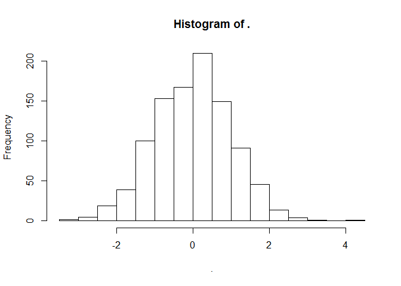

It works
================
@vivekbhr
Wed Jul 13 14:23:55 2016

``` r
library(magrittr)
```

It works!
---------

``` r
lapply(1:4, function(n) print(rep("It works",n)) )
```

    ## [1] "It works"
    ## [1] "It works" "It works"
    ## [1] "It works" "It works" "It works"
    ## [1] "It works" "It works" "It works" "It works"

    ## [[1]]
    ## [1] "It works"
    ## 
    ## [[2]]
    ## [1] "It works" "It works"
    ## 
    ## [[3]]
    ## [1] "It works" "It works" "It works"
    ## 
    ## [[4]]
    ## [1] "It works" "It works" "It works" "It works"

### Hi world, it works.

``` r
rnorm(1000) %>% hist()
```


